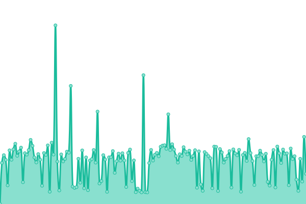
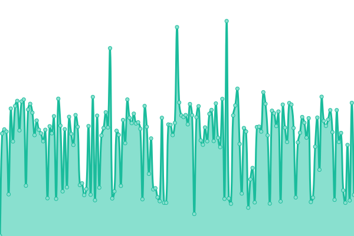
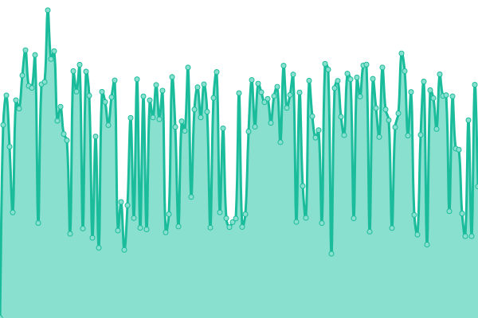
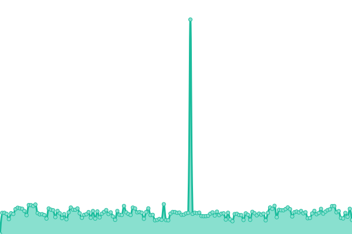
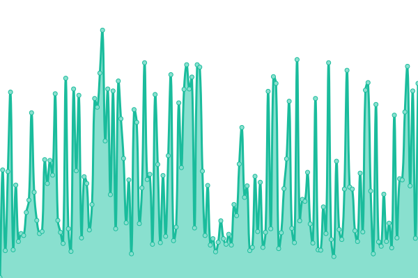

# [📈 Live Status](https://dlee-calbaptist.github.io/monitor): <!--live status--> **🟩 All systems operational**

This repository contains the open-source uptime monitor and status page for [dlee-calbaptist](https://dlee-calbaptist.github.io/monitor), powered by [Upptime](https://github.com/upptime/upptime).

With [Upptime](https://upptime.js.org), you can get your own unlimited and free uptime monitor and status page, powered entirely by a GitHub repository. We use [Issues](https://github.com/dlee-calbaptist/monitor/issues) as incident reports, [Actions](https://github.com/dlee-calbaptist/monitor/actions) as uptime monitors, and [Pages](https://dlee-calbaptist.github.io/monitor) for the status page.

<!--start: status pages-->
<!-- This summary is generated by Upptime (https://github.com/upptime/upptime) -->
<!-- Do not edit this manually, your changes will be overwritten -->
<!-- prettier-ignore -->
| URL | Status | History | Response Time | Uptime |
| --- | ------ | ------- | ------------- | ------ |
|  [CalBaptist Main Website](https://www.calbaptist.edu) | 🟩 Up | [cal-baptist-main-website.yml](https://github.com/dlee-calbaptist/monitor/commits/HEAD/history/cal-baptist-main-website.yml) | 

 653ms
     
 | 

<a href="https://dlee-calbaptist.github.io/monitor/history/cal-baptist-main-website">100.00%</a>
    

|  [InsideCBU](https://insidecbu.calbaptist.edu) | 🟩 Up | [inside-cbu.yml](https://github.com/dlee-calbaptist/monitor/commits/HEAD/history/inside-cbu.yml) | 

 490ms
     
 | 

<a href="https://dlee-calbaptist.github.io/monitor/history/inside-cbu">99.51%</a>
    

|  [CBU Online Website](https://cbuonline.edu) | 🟩 Up | [cbu-online-website.yml](https://github.com/dlee-calbaptist/monitor/commits/HEAD/history/cbu-online-website.yml) | 

 819ms
     
 | 

<a href="https://dlee-calbaptist.github.io/monitor/history/cbu-online-website">92.61%</a>
    

|  [CalBaptist Box.com](https://calbaptist.app.box.com) | 🟩 Up | [cal-baptist-box-com.yml](https://github.com/dlee-calbaptist/monitor/commits/HEAD/history/cal-baptist-box-com.yml) | 

 563ms
     
 | 

<a href="https://dlee-calbaptist.github.io/monitor/history/cal-baptist-box-com">100.00%</a>
    

|  [Blackboard Learn](https://calbaptist.blackboard.com) | 🟩 Up | [blackboard-learn.yml](https://github.com/dlee-calbaptist/monitor/commits/HEAD/history/blackboard-learn.yml) | 

 248ms
     
 | 

<a href="https://dlee-calbaptist.github.io/monitor/history/blackboard-learn">100.00%</a>
    

<!--end: status pages-->

[**Visit our status website →**](https://dlee-calbaptist.github.io/monitor)

## 📄 License

- Powered by: [Upptime](https://github.com/upptime/upptime)
- Code: [MIT](./LICENSE) © [dlee-calbaptist](https://dlee-calbaptist.github.io/monitor)
- Data in the `./history` directory: [Open Database License](https://opendatacommons.org/licenses/odbl/1-0/)
